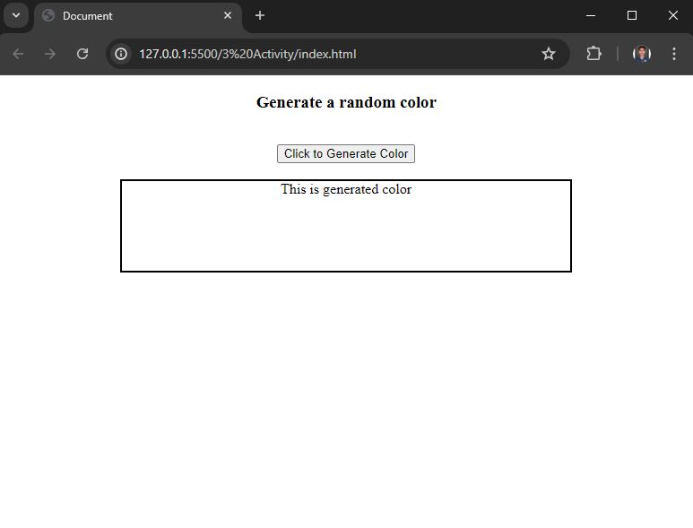
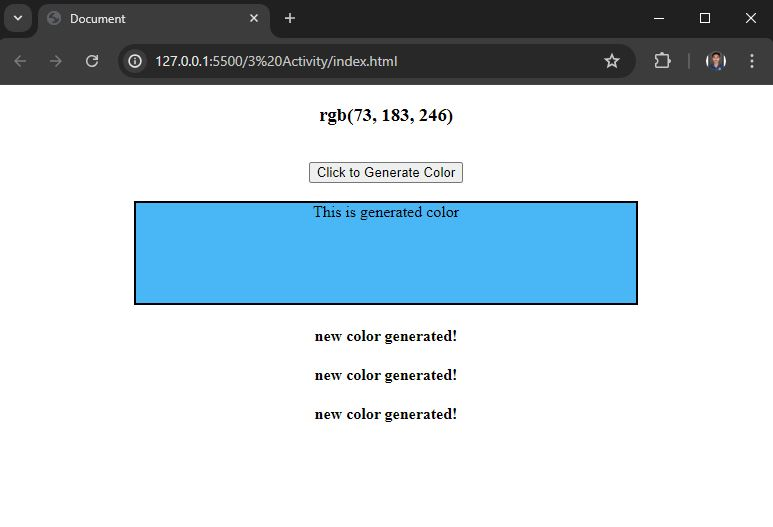
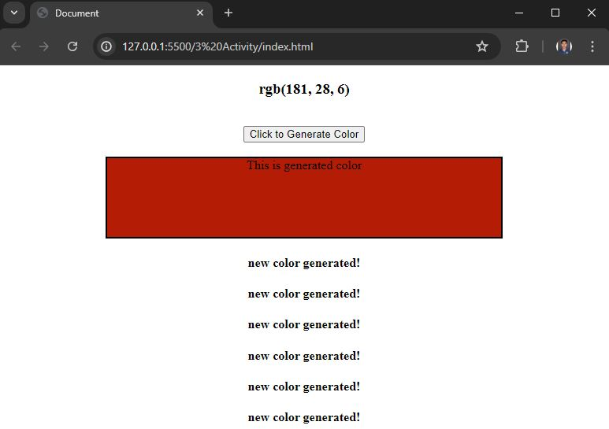

# Random Color Generator

This project is a simple web application that generates a random color and updates the background color of a div element on a button click. It also displays the generated color code and adds a message indicating that a new color has been generated.

## Features

- Generates a random RGB color on button click.
- Updates the background color of a specified div with the generated color.
- Displays the RGB color code in an h3 element.
- Adds an h4 element with a message each time a new color is generated.

### Screenshot





## Learnings
Through this Random Color Generator project, I learned:

1. **DOM Manipulation:** How to select and manipulate HTML elements using JavaScript.
2. **Event Handling:** Adding event listeners to handle user interactions like button clicks.
3. **Dynamic Styling:** Changing the background color of elements dynamically.
4. **Element Creation:** Creating and inserting new HTML elements into the DOM.
5. **Random Number Generation:** Using `Math.random()` to generate random RGB values.
6. **Code Refactoring:** Writing cleaner and more maintainable code.
7. **CSS Styling:** Enhancing the user interface with CSS for a better user experience.

This project was a great hands-on experience to solidify my understanding of these key JavaScript concepts!

### Installation

1. Clone the repository:
    ```bash
    git clone https://github.com/ratnesh1253/random-color-generator.git
    ```
2. Navigate to the project directory:
    ```bash
    cd random-color-generator
    ```

### Usage

1. Open the `index.html` file in your web browser.
2. Click the "Click to Generate Color" button to generate a random color.

### Files

- `index.html`: The HTML file that sets up the structure of the web page.
- `style.css`: The CSS file that styles the web page.
- `app.js`: The JavaScript file that contains the logic for generating random colors and updating the DOM.

## Contact

If you have any questions or feedback, feel free to contact me at [email](mailto:ratneshkshirsagar1253@gmail.com).
```
